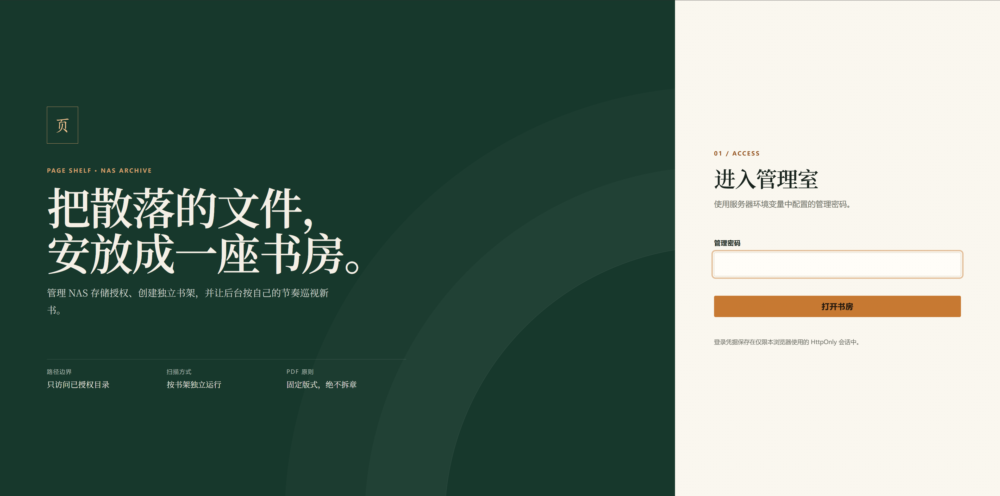
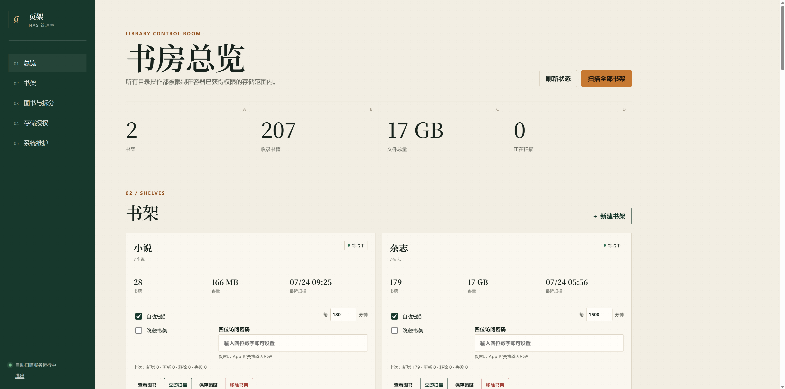

# 页架 Page Shelf

> **NAS 图书管理器 / NAS Library Manager**

页架是一款自托管的本地图书文件管理与阅读工具。后端负责扫描、整理和传输 NAS 或服务器中已有的
TXT、EPUB、MOBI、PDF 文件；网页阅读器提供免安装的纵向阅读，Android App 提供离线下载、阅读进度同步与
完全离线的中文朗读。

> [!IMPORTANT]
> **项目声明 / Project notice**：本项目仅用于管理用户自己拥有或有权使用的本地图书文件，不包含、
> 不内置、不提供，也不分发任何图书资源。请遵守所在地法律法规和内容版权要求。
>
> Page Shelf only manages local book files that users own or are authorized to use. It does not include, provide,
> bundle, or distribute any book content.

[](LICENSE)


## 管理界面 / Admin UI

| 登录 / Sign in | 书房总览 / Dashboard |
| --- | --- |
|  |  |

截图中的图书统计仅为界面展示示例，不随项目或 Release 分发。

## 当前功能 / Features

### 服务端与网页

- 管理后台：登记授权存储位置，创建公开、隐藏或 PIN 保护书架，手动或定时扫描书籍；支持修改书名、
  作者、封面和单书章节拆分策略。
- 网页阅读器：访问 `/reader` 即可登录，支持书架切换、书名/作者搜索、受保护书架解锁和阅读进度
  同步。TXT/EPUB/MOBI 使用纵向滚动并在章末自动续接，PDF 保留原版页面和书签目录；主题、字体和字号保存
  在当前浏览器。
- 格式处理：TXT 支持多种章节规则与固定长度回退，EPUB 按内部导航和 spine 顺序解析；未加密的
  MOBI 在服务端解包为可重排章节，保留可用的目录、书名、作者和内嵌封面；PDF 保留固定版式、页数和
  原生书签，不执行 OCR。
- 文件与安全：原始书籍只读挂载，不因移除书架或客户端缓存而删除；文件下载支持 Range、ETag 和
  断点续传。管理 Cookie 与阅读 Bearer 会话分离，存储路径受授权根目录限制，CORS 和 API 文档默认
  关闭。

### Android App

- 书架与阅读：横向切换书架、搜索书名或作者、解锁 PIN 书架；TXT/EPUB/MOBI 支持左右翻页或上下滚动，
  PDF 支持原版按页渲染、缩放、书签导航和有限页缓存。
- 离线能力：整本下载、断点续传、SHA-256 校验、失败重试、临时缓存清理和完全离线阅读。
- 阅读进度：本地优先保存，联网后自动重试同步，并在跨设备或内容变化时提示冲突处理。
- 中英朗读：sherpa-onnx + Matcha-TTS，内置单一女声，全程端侧生成，正文不上传第三方服务。

### 实验性独立 TTS 服务

`tts/` 提供单独部署的 Qwen3-TTS Docker 服务，面向 Intel 核显 NAS 测试 OpenVINO GPU 推理，并在
GPU 不可用时按配置回退到 CPU。它提供完整 WAV 接口、可选 Bearer Token、设备状态和 RTF 指标，
目前尚未接入网页阅读器或 Android App，也不会替换 App 内置的 Matcha 离线朗读。部署和基准方法见
[Qwen TTS 服务说明](tts/README.md)。

## Docker 快速部署 / Quick Deploy

需要 Docker Engine 24+ 和 Docker Compose v2。公开镜像同时提供 `linux/amd64` 与 `linux/arm64`，
适用于常见 x86 NAS、服务器和 ARM NAS。

拉取最新后端镜像：

```bash
docker pull ghcr.io/samworthington39-commits/page-shelf:latest
```

下载部署文件并启动：

```bash
mkdir page-shelf && cd page-shelf
curl -LO https://raw.githubusercontent.com/samworthington39-commits/page-shelf/main/deploy/compose.yaml
curl -Lo .env https://raw.githubusercontent.com/samworthington39-commits/page-shelf/main/deploy/.env.example
mkdir -p library data
docker compose pull
docker compose up -d
```

也可以从 [Releases](https://github.com/samworthington39-commits/page-shelf/releases) 下载
`page-shelf-<版本>-docker.zip`，解压后执行 `docker compose up -d`。固定版本部署可在 `.env` 中设置
`PAGE_SHELF_VERSION=v1.0.9`，或直接拉取：

```bash
docker pull ghcr.io/samworthington39-commits/page-shelf:v1.0.9
```

部署完成后，各网页界面的完整 URL 如下：

| 界面 | URL | 用途 |
| --- | --- | --- |
| 管理后台 | `http://<服务器IP>:8000/admin` | 首次改密、存储位置、书架、扫描、元数据、封面和系统维护 |
| 网页书架与阅读器 | `http://<服务器IP>:8000/reader` | 浏览书架，阅读 TXT、EPUB、MOBI 和 PDF，同步阅读进度 |
| Swagger API 文档（可选） | `http://<服务器IP>:8000/docs` | 仅在设置 `ENABLE_API_DOCS=true` 后开放 |
| ReDoc API 文档（可选） | `http://<服务器IP>:8000/redoc` | 仅在设置 `ENABLE_API_DOCS=true` 后开放 |

管理后台中的登录、书架管理和系统维护是同一个单页界面，没有各自独立的 URL。项目未提供根路径首页，
直接访问 `http://<服务器IP>:8000/` 会返回 404。

其他连接信息：

| 项目 | 地址或内容 |
| --- | --- |
| Android App 服务器地址 | `http://<服务器IP>:8000`，不要添加 `/admin` 或 `/api/v1` |
| 健康检查接口 | `http://<服务器IP>:8000/health`，这是接口而不是网页界面 |
| 默认管理密码 | `112233`；首次登录后必须立即修改 |
| 书籍目录 | 宿主机 `library/`，容器内 `/library` |
| 持久数据 | 宿主机 `data/`，包括数据库、封面和管理凭据 |

进入管理界面后：

1. 使用默认密码 `112233` 登录并设置至少 8 位的新密码；
2. 登记容器内路径 `/library`；
3. 创建书架并扫描自己已有的本地图书文件；
4. 浏览器打开 `/reader`，或在 Android App 中填写服务器地址和修改后的管理密码。

在部署服务器本机访问时，可将 `<服务器IP>` 换成 `localhost`。会话密钥会在首次启动时自动随机生成并
保存在 `data/admin_credentials.json`。如需预先指定初始密码，可修改 `.env` 中的
`ADMIN_PASSWORD`。

## 从源码部署 / Build from Source

需要 Docker Engine 24+ 和 Docker Compose v2。

```bash
git clone https://github.com/samworthington39-commits/page-shelf.git
cd page-shelf
cp .env.example .env
mkdir -p library data
```

将 TXT、EPUB、MOBI 或 PDF 文件放入 `library/`，然后启动：

```bash
docker compose up -d --build
docker compose ps
```

MOBI 支持范围是未加密、可重排的 `.mobi` 电子书。受 DRM 保护的文件不会被绕过或导入；Print Replica
固定版式 MOBI 请先合法转换为 PDF。单个 MOBI 最大 256 MiB，解包内容会写入容器临时目录并在导入后清理。

更完整的 Docker、NAS、HTTPS、备份与无 Docker 部署步骤见
[使用与部署文档](docs/getting-started.md)。

## Android App / 安卓客户端

App 支持 Android 8.0（API 26）及以上，目前只打包 `arm64-v8a`。先在网页管理界面完成首次改密，
然后从 [Releases](https://github.com/samworthington39-commits/page-shelf/releases) 下载 APK，安装后
填写后端地址和新密码：

```text
192.168.1.10:8000
http://192.168.1.10:8000
https://reader.example.com
```

局域网地址允许 HTTP；公网域名必须使用 HTTPS。App 会验证 API 主版本，然后使用管理密码换取短期
Bearer 会话。密码不持久化，会话令牌使用 Android Keystore 加密保存。

从源码构建：

```powershell
git lfs install
git lfs pull
Set-Location android
.\gradlew.bat assembleDebug
```

Linux/macOS 使用 `./gradlew assembleDebug`。APK 输出位于 `android/app/build/outputs/apk/debug/`。
GitHub Release 中的 APK 使用项目发布密钥签名；自行构建的 Debug APK 使用本机开发签名，二者不能互相
覆盖安装。

## 克隆与大文件

Matcha 声学模型、Vocos 与文本处理资源合计约 142 MiB；两个 ONNX 文件使用 Git LFS 管理。构建
Android App 前需要安装
[Git LFS](https://git-lfs.com/)：

```bash
git lfs install
git clone <your-repository-url>
cd <repository-directory>
git lfs pull
```

只部署后端时无需下载 Android 模型，可以使用：

```bash
GIT_LFS_SKIP_SMUDGE=1 git clone <your-repository-url>
```

## 配置

所有服务端配置均通过 `.env` 或容器环境变量提供。不要提交真实 `.env`。

| 变量 | 默认值 | 说明 |
| --- | --- | --- |
| `ADMIN_PASSWORD` | `112233` | 仅用于首次初始化；已有凭据文件时不会覆盖后台已修改的密码 |
| `ADMIN_SESSION_SECRET` | 自动生成 | 可选的首次初始化会话密钥；留空时生成安全随机值 |
| `ADMIN_CREDENTIALS_PATH` | Docker 中为 `/data/admin_credentials.json` | 持久化的密码哈希和会话密钥文件 |
| `ADMIN_SESSION_HOURS` | `24` | 会话有效小时数 |
| `LIBRARY_PATH` | Docker 中为 `/library` | 默认书库路径 |
| `DATABASE_URL` | Docker 中为 `sqlite:////data/bookshelf.db` | SQLAlchemy 数据库 URL |
| `COVER_PATH` | Docker 中为 `/data/covers` | 派生封面目录 |
| `STORAGE_ALLOWED_ROOTS` | 空 | 额外允许的容器内根路径，逗号分隔 |
| `STORAGE_AUTO_DISCOVER_MOUNTS` | `true` | 是否发现额外容器挂载点 |
| `STORAGE_EXCLUDED_ROOTS` | `/data` | 禁止登记为书库的路径，逗号分隔 |
| `AUTO_SCAN_POLL_SECONDS` | `30` | 自动扫描轮询间隔 |
| `CORS_ORIGINS` | 空 | 允许的 Web 来源，逗号分隔；不接受 `*` |
| `ENABLE_API_DOCS` | `false` | 是否启用 `/docs`、`/redoc` 和 OpenAPI JSON |
| `PYTHON_IMAGE` | `python:3.12-slim` | Docker 基础镜像或镜像代理地址 |

## 开发与测试

后端：

```powershell
python -m venv .venv
.\.venv\Scripts\python -m pip install -e ".\backend[test]"
Set-Location backend
..\.venv\Scripts\python -m pytest -q
```

Android：

```powershell
Set-Location android
.\gradlew.bat testDebugUnitTest lintRelease assembleDebug
```

开发环境、目录结构、CI 和发布流程见 [开发指南](docs/development.md)。

## Release 文件 / Release Assets

每个正式版本提供：

- `page-shelf-<版本>-arm64.apk`：Android 8.0+、`arm64-v8a` 客户端；
- `page-shelf-<版本>-docker.zip`：后端 Docker Compose、环境变量示例和部署说明；
- `SHA256SUMS.txt`：下载文件完整性校验；
- `ghcr.io/samworthington39-commits/page-shelf:<版本>`：`amd64`/`arm64` 后端容器镜像。

## 发布到 GitHub / Publishing

首次建仓、Git LFS 推送、分支保护、Release 和克隆回验步骤见
[GitHub 发布指南](docs/github-publishing.md)。仓库当前不会自动提交或上传你的本地文件，请在发布前按指南
检查待提交内容，尤其不要加入 `.env`、数据库、书籍、私人路径和签名密钥。

## 项目结构

```text
backend/                 FastAPI API、管理后台、网页阅读器和测试
android/                 Kotlin/Jetpack Compose Android App 与端侧 Matcha 朗读
tts/                     独立的实验性 Qwen3-TTS Docker 服务
docs/                    部署、架构、安全、PDF 和许可证文档
compose.yaml             默认后端与网页部署
THIRD_PARTY_NOTICES.md   主项目第三方软件、模型和数据声明
```

- [架构与数据边界](docs/architecture.md)
- [安全与部署边界](docs/security.md)
- [PDF 行为约定](docs/pdf-contract.md)
- [开源依赖与许可证清单](docs/open-source-compliance.md)

## 贡献

提交 Issue 或 Pull Request 前请阅读 [CONTRIBUTING.md](CONTRIBUTING.md)。安全漏洞不要公开提交，按
[安全报告说明](.github/SECURITY.md)处理。

## 许可证

项目原创代码采用 [GNU Affero General Public License v3.0 only](LICENSE)。部署修改版后端并通过网络
向用户提供服务时，也必须向这些用户提供对应源码。

第三方库、模型和数据保留各自许可证，详见 [THIRD_PARTY_NOTICES.md](THIRD_PARTY_NOTICES.md)。
Matcha 模型元数据标注 Apache-2.0，Vocos 为 MIT；模型训练数据来源信息仍不完整，商业化前需要重新核查。
